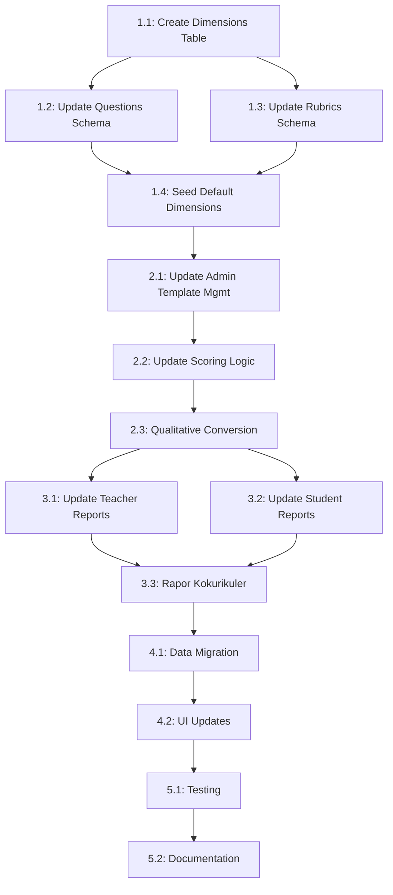

# Implementation Task Breakdown: Sistem Penilaian Per Dimensi

**Created**: October 4, 2025
**Priority**: HIGH
**Status**: READY FOR IMPLEMENTATION
**PRD Reference**: JejakBelajar V9.0 - Section 3.4 & 4

## 🎯 **Objective**

Mengimplementasikan sistem penilaian per dimensi sesuai PRD JejakBelajar V9.0 yang saat ini belum ada di aplikasi.

## 📊 **Current State vs Required State**

### ❌ **Current Implementation (WRONG):**
- Scoring by instrument type: `observation`, `journal`, `daily_note`
- Simple averaging logic
- Hardcoded grade thresholds
- No dimensions table
- No dimension-based reporting

### ✅ **Required Implementation (PRD):**
- Scoring by dimensions: "Kreativitas", "Kolaborasi", etc.
- Score aggregation per dimension
- Qualitative conversion using µ & 𝝈 formulas
- `dimensions` table with proper relationships
- Complete dimension-based reporting system

---

## 🗂️ **Task Breakdown**

### **Phase 1: Database Schema Migration** ⚙️

#### **Task 1.1: Create Dimensions Table**
**Priority**: CRITICAL
**Estimated Time**: 2-3 hours
**Files to Modify**:
- `drizzle/schema.ts`
- Create new migration file

**Requirements**:
```sql
CREATE TABLE dimensions (
    id UUID PRIMARY KEY DEFAULT gen_random_uuid(),
    name VARCHAR(255) UNIQUE NOT NULL, -- e.g., "Kreativitas", "Kolaborasi"
    description TEXT,
    created_by_admin_id UUID REFERENCES users(id) ON DELETE SET NULL,
    created_at TIMESTAMPTZ DEFAULT now(),
    updated_at TIMESTAMPTZ DEFAULT now()
);
```

**Acceptance Criteria**:
- [ ] Table `dimensions` created successfully
- [ ] Proper foreign key to `users.id` for admin
- [ ] Unique constraint on `name`
- [ ] Migration runs without errors

---

#### **Task 1.2: Update Template Questions Schema**
**Priority**: CRITICAL
**Estimated Time**: 1-2 hours
**Files to Modify**:
- `drizzle/schema.ts`
- Migration file

**Requirements**:
```sql
ALTER TABLE template_questions
ADD COLUMN dimension_id UUID REFERENCES dimensions(id) ON DELETE SET NULL;

-- Update existing questions to link to appropriate dimensions
```

**Acceptance Criteria**:
- [ ] `dimension_id` column added to `template_questions`
- [ ] Foreign key constraint properly set up
- [ ] Backward migration script for existing data

---

#### **Task 1.3: Update Journal Rubrics Schema**
**Priority**: CRITICAL
**Estimated Time**: 1-2 hours
**Files to Modify**:
- `drizzle/schema.ts`
- Migration file

**Requirements**:
```sql
ALTER TABLE template_journal_rubrics
ADD COLUMN dimension_id UUID REFERENCES dimensions(id) ON DELETE SET NULL;
```

**Acceptance Criteria**:
- [ ] `dimension_id` column added to `template_journal_rubrics`
- [ ] Foreign key constraint properly set up
- [ ] Backward migration script for existing rubrics

---

#### **Task 1.4: Create Seed Data for Default Dimensions**
**Priority**: HIGH
**Estimated Time**: 1-2 hours
**Files to Create**:
- `db/seed/dimensions.ts`
- Update `db/seed/index.ts`

**Required Dimensions** (sesuai P5):
```typescript
const defaultDimensions = [
  { name: "Kreativitas", description: "Kemampuan berpikir kreatif dan inovatif" },
  { name: "Kolaborasi", description: "Kemampuan bekerja sama dalam tim" },
  { name: "Komunikasi", description: "Kemampuan menyampaikan ide dan mendengarkan" },
  { name: "Berpikir Kritis", description: "Kemampuan analisis dan evaluasi" },
  { name: "Sosial Emosional", description: "Kecerdasan emosional dan kemampuan sosial" },
  // Add other P5 dimensions as needed
]
```

**Acceptance Criteria**:
- [ ] Default P5 dimensions created
- [ ] Seed script runs successfully
- [ ] Idempotent seed (won't duplicate on re-run)

---

### **Phase 2: Update Core Business Logic** 🧠

#### **Task 2.1: Update Admin Template Management**
**Priority**: HIGH
**Estimated Time**: 4-6 hours
**Files to Modify**:
- `app/dashboard/admin/_components/admin-dashboard/sections/templates/`
- `app/dashboard/admin/actions.ts`
- Related query files

**Requirements**:
- Admin can select dimension when creating questions
- Admin can select dimension when creating journal rubrics
- UI shows dimension dropdown with search
- Validation: At least one question/rubric per dimension

**Acceptance Criteria**:
- [ ] Dimension dropdown in question creation dialog
- [ ] Dimension dropdown in rubric creation dialog
- [ ] Proper validation and error handling
- [ ] Backend API accepts dimension_id
- [ ] Questions and rubrics properly linked to dimensions

---

#### **Task 2.2: Update Submission Scoring Logic**
**Priority**: CRITICAL
**Estimated Time**: 6-8 hours
**Files to Modify**:
- `app/dashboard/teacher/actions.ts`
- `app/dashboard/student/actions.ts`
- Create new scoring service files

**Requirements**:
```typescript
// New scoring structure
interface DimensionScore {
  dimensionId: string;
  dimensionName: string;
  totalScore: number;
  maxScore: number;
  itemCount: number;
  qualitativeScore: string; // "Sangat Baik", "Baik", etc.
}

interface StudentDimensionScores {
  studentId: string;
  projectId: string;
  dimensions: DimensionScore[];
  overallScore: number;
  overallQualitative: string;
}
```

**Acceptance Criteria**:
- [ ] Scores grouped by dimension (not by instrument type)
- [ ] Each dimension calculates average properly
- [ ] Raw scores stored with dimension metadata
- [ ] Backward compatibility with existing submissions

---

#### **Task 2.3: Implement Qualitative Score Conversion**
**Priority**: HIGH
**Estimated Time**: 4-6 hours
**Files to Create**:
- `lib/scoring/qualitative-conversion.ts`
- `lib/scoring/types.ts`

**Requirements** (sesuai PRD):
```typescript
interface QualitativeConversion {
  // Score calculation per dimension
  calculateDimensionScore(scores: number[]): number {
    // X = (sum of all item scores) / (total items × 4) × 100
    const totalItems = scores.length;
    const sumScores = scores.reduce((a, b) => a + b, 0);
    return (sumScores / (totalItems * 4)) * 100;
  }

  // Qualitative conversion using µ & 𝝈
  calculateQualitativeScore(score: number, dimensionId: string): string {
    // µ = ½(ideal minimum score + ideal maximum score)
    // 𝝈 = ½(ideal maximum score - ideal minimum score)
    const mu = (idealMin + idealMax) / 2;
    const sigma = (idealMax - idealMin) / 2;

    // Apply intervals for qualitative categories
    if (score >= mu + sigma) return "Sangat Baik";
    if (score >= mu) return "Baik";
    if (score >= mu - sigma) return "Cukup";
    return "Perlu Peningkatan";
  }
}
```

**Acceptance Criteria**:
- [ ] Proper µ and 𝝈 calculation
- [ ] Correct interval application
- [ ] Configurable thresholds per dimension
- [ ] Unit tests for all scenarios

---

### **Phase 3: Update Reporting System** 📈

#### **Task 3.1: Update Teacher Reporting Queries**
**Priority**: HIGH
**Estimated Time**: 6-8 hours
**Files to Modify**:
- `app/dashboard/teacher/reports/queries.ts`
- `app/dashboard/teacher/reports/_components/teacher-reports-dashboard.tsx`
- `app/api/teacher/reports/route.ts`

**Requirements**:
```typescript
// New report structure
interface TeacherReportData {
  classes: Array<{
    id: string;
    name: string;
    totalStudents: number;
    dimensionAverages: {
      [dimensionId: string]: {
        dimensionName: string;
        averageScore: number;
        qualitativeScore: string;
        studentCount: number;
      }
    };
    overallAverage: number;
    overallQualitative: string;
  }>;
  // ... other fields
}
```

**Acceptance Criteria**:
- [ ] Query joins with `dimensions` table
- [ ] Scores grouped by dimension, not instrument type
- [ ] Proper aggregation formulas applied
- [ ] Qualitative scores calculated correctly
- [ ] UI shows dimension-based breakdown

---

#### **Task 3.2: Update Student Reporting**
**Priority**: HIGH
**Estimated Time**: 4-6 hours
**Files to Modify**:
- `app/dashboard/student/_components/student-dashboard/project-detail.tsx`
- Student progress views

**Requirements**:
- Students see their scores per dimension
- Progress bars for each dimension
- Qualitative descriptions
- Historical tracking

**Acceptance Criteria**:
- [ ] Dimension scores visible to students
- [ ] Progress visualization per dimension
- [ ] Qualitative feedback displayed
- [ ] Comparison with class average (optional)

---

#### **Task 3.3: Implement Rapor Kokurikuler**
**Priority**: MEDIUM
**Estimated Time**: 6-10 hours
**Files to Create**:
- `app/dashboard/teacher/reports/[classId]/rapor-kokurikuler/page.tsx`
- `components/rapor-kokurikuler/`
- PDF generation logic

**Requirements**:
- Official co-curricular report format
- All dimensions with scores and qualitative assessments
- Teacher's comments
- Student achievements
- Printable PDF format

**Acceptance Criteria**:
- [ ] Official report template created
- [ ] All dimensions included
- [ ] Proper score formatting
- [ ] PDF generation works
- [ ] Teacher can add comments

---

### **Phase 4: Data Migration & UI Updates** 🔄

#### **Task 4.1: Migrate Existing Data**
**Priority**: HIGH
**Estimated Time**: 3-4 hours
**Files to Create**:
- `db/migrations/migrate-to-dimensions.ts`
- Backup scripts

**Requirements**:
- Map existing instruments to appropriate dimensions
- Update all existing template questions
- Update all existing journal rubrics
- Maintain data integrity

**Acceptance Criteria**:
- [ ] All existing questions linked to dimensions
- [ ] All existing rubrics linked to dimensions
- [ ] No data loss during migration
- [ ] Rollback script available

---

#### **Task 4.2: Update UI Components**
**Priority**: MEDIUM
**Estimated Time**: 8-12 hours
**Files to Modify**:
- All assessment dialogs
- Review interfaces
- Report visualizations

**Requirements**:
- Show dimension names instead of instrument types
- Color coding per dimension
- Improved visualizations
- Responsive design

**Acceptance Criteria**:
- [ ] All UI shows dimension-based information
- [ ] Consistent color scheme per dimension
- [ ] Improved user experience
- [ ] Mobile responsive

---

### **Phase 5: Testing & Documentation** 🧪

#### **Task 5.1: Comprehensive Testing**
**Priority**: HIGH
**Estimated Time**: 6-8 hours
**Files to Create**:
- `__tests__/scoring/dimension-scoring.test.ts`
- `__tests__/api/reports.test.ts`
- E2E test scenarios

**Requirements**:
- Unit tests for scoring logic
- Integration tests for API endpoints
- E2E tests for complete workflows
- Performance testing for large datasets

**Acceptance Criteria**:
- [ ] All scoring functions tested
- [ ] API endpoints validated
- [ ] Complete user journeys tested
- [ ] Performance benchmarks met

---

#### **Task 5.2: Update Documentation**
**Priority**: MEDIUM
**Estimated Time**: 2-3 hours
**Files to Modify**:
- `README.md`
- `docs/` directory
- API documentation

**Requirements**:
- Update system architecture docs
- API endpoint documentation
- User guides
- Developer documentation

**Acceptance Criteria**:
- [ ] Documentation reflects new system
- [ ] API docs updated
- [ ] User guides created
- [ ] Migration guides provided

---

## 🚀 **Implementation Order & Dependencies**



## ⚠️ **Critical Considerations**

### **Backward Compatibility**:
- Existing submissions must remain accessible
- Graceful degradation for old data
- API versioning if needed

### **Performance**:
- Efficient queries for dimension aggregation
- Index optimization for new foreign keys
- Caching strategies for frequent calculations

### **Data Integrity**:
- All questions/rubrics must have dimensions
- Validation at database and application level
- Proper constraints and cascading rules

### **Rollback Strategy**:
- Database migration rollback scripts
- Feature flags for gradual rollout
- Monitoring and alerting

## 📊 **Success Metrics**

1. **Functional Metrics**:
   - All PRD requirements implemented
   - No data loss during migration
   - 100% backward compatibility

2. **Performance Metrics**:
   - Report generation < 3 seconds
   - Score calculation < 1 second
   - DB query optimization

3. **User Experience Metrics**:
   - Intuitive dimension-based interface
   - Clear qualitative feedback
   - Improved reporting insights

---

## 🎯 **Next Steps**

1. **Immediate**: Start with Phase 1 (Database Schema)
2. **Priority**: Focus on critical path items (1.1 → 1.4 → 2.2 → 2.3 → 3.1)
3. **Testing**: Implement testing in parallel with development
4. **Deployment**: Plan for phased rollout with monitoring

**Estimated Total Time**: 60-80 hours across all phases
**Recommended Team Size**: 2-3 developers
**Target Completion**: 2-3 weeks with dedicated resources