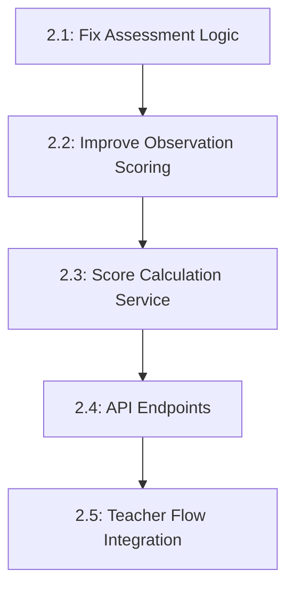

# Task 2: Perbaikan Sistem Penghitungan Score per Dimensi

**Priority**: HIGH
**Status**: READY FOR IMPLEMENTATION
**Estimated Time**: 8-12 hours

## <¯ **Objective**
Memperbaiki logic penghitungan score untuk **Peer Assessment, Self Assessment, dan Observation** agar menghasilkan skor per dimensi yang benar sesuai PRD V6 dan mengimplementasikan perhitungan otomatis.

## =
 **Current Issues**

### **Critical Issues Found**:
1. **Mapping Answer-Question salah**: Function `calculateAssessmentDimensionScores()` mengasumsikan `answers[i]` sesuai dengan urutan questions, tapi tidak ada jaminan urutan yang konsisten
2. **Score tidak terhitung otomatis**: Semua submissions memiliki `score: null` - tidak ada proses kalkulasi otomatis
3. **Observation scoring tidak standar**: Function `calculateObservationDimensionScores()` menggunakan logic berbeda dari assessment lainnya
4. **Peer assessment aggregation belum ada**: Multiple peer assessments untuk satu student belum diagregasi dengan benar

### **Data Structure Analysis**:
- **OBSERVATION**: `{ "answers": [2, 3] }` - Teacher isi score per question (1-4)
- **PEER_ASSESSMENT**: `{ "answers": [3, 2] }` - Student nilai teman (1-4)
- **SELF_ASSESSMENT**: `{ "answers": [4, 2, 3, 1, 2, 3] }` - Student nilai diri (1-4)

### **Database Mapping Issues**:
- Config ID `d14942a4...` (SELF_ASSESSMENT): 6 questions ’ 2 dimensions
- Config ID `b96f81dc...` (PEER_ASSESSMENT): 1 question ’ 1 dimension
- Config ID `56ac1baf...` (OBSERVATION): 2 questions ’ 1 dimension

---

## =Ë **Task Breakdown**

### **Task 2.1: Fix Assessment Scoring Logic**
**Priority**: CRITICAL
**Estimated Time**: 3-4 hours
**Files to Modify**:
- `lib/scoring/dimension-scorer.ts`

**Requirements**:
```typescript
// Perbaiki mapping logic di calculateAssessmentDimensionScores()
// Dari yang saat ini (salah):
for (let i = 0; i < dimensionQuestions.length; i++) {
  const question = dimensionQuestions[i]
  const answer = answers[i] // L Index mapping tidak reliable
}

// Menjadi yang benar:
// Query questions dengan ORDER BY untuk konsistensi
// Map answer ke question berdasarkan posisi yang pasti
```

**Acceptance Criteria**:
- [ ] Answer mapping menggunakan urutan questions yang konsisten
- [ ] Score calculation menghasilkan nilai yang benar per dimensi
- [ ] Handle cases dimana questions tidak memiliki dimension_id
- [ ] Unit test untuk semua assessment types

---

### **Task 2.2: Improve Observation Scoring**
**Priority**: CRITICAL
**Estimated Time**: 2-3 hours
**Files to Modify**:
- `lib/scoring/dimension-scorer.ts`

**Requirements**:
```typescript
// Perbaiki calculateObservationDimensionScores()
// Dari yang saat ini (terlalu sederhana):
// Hanya menggunakan single score tanpa mapping ke questions

// Menjadi yang benar:
// Gunakan questions yang sama seperti assessment types lain
// Hitung skor per dimensi dengan multiple questions
// Gunakan mapping yang konsisten dengan assessment lainnya
```

**Acceptance Criteria**:
- [ ] Observation scoring menggunakan questions yang sesuai
- [ ] Generate dimension scores seperti assessment types lain
- [ ] Handle multiple questions per dimension
- [ ] Konsistent dengan calculateAssessmentDimensionScores()

---

### **Task 2.3: Create Score Calculation Service**
**Priority**: HIGH
**Estimated Time**: 2-3 hours
**Files to Create**:
- `lib/scoring/score-calculator.ts`

**Requirements**:
```typescript
interface ScoreCalculator {
  // Hitung dan update score untuk single submission
  calculateSubmissionScore(submissionId: string): Promise<void>

  // Batch process submissions yang belum dihitung
  processPendingSubmissions(projectId?: string): Promise<number>

  // Aggregate multiple peer assessments
  aggregatePeerScores(targetStudentId: string, projectId: string): Promise<DimensionScore[]>
}
```

**Acceptance Criteria**:
- [ ] Service dapat menghitung score untuk semua instrument types
- [ ] Update submissions.score field secara otomatis
- [ ] Handle peer assessment aggregation dengan benar
- [ ] Error handling untuk invalid data

---

### **Task 2.4: Create API Endpoints for Score Calculation**
**Priority**: HIGH
**Estimated Time**: 2 hours
**Files to Create**:
- `app/api/scoring/calculate/[submissionId]/route.ts`
- `app/api/scoring/process-batch/route.ts`
- `app/api/scoring/aggregate-peer/[targetStudentId]/route.ts`

**Requirements**:
- POST endpoint untuk trigger kalkulasi single submission
- POST endpoint untuk batch processing submissions
- GET endpoint untuk aggregated peer scores
- Proper error handling dan validation

**Acceptance Criteria**:
- [ ] API endpoints dapat dipanggil dan return proper response
- [ ] Validation untuk submission IDs dan parameter lainnya
- [ ] Integration dengan score calculation service
- [ ] Rate limiting dan security measures

---

### **Task 2.5: Update Teacher Assessment Flow**
**Priority**: MEDIUM
**Estimated Time**: 1-2 hours
**Files to Modify**:
- `app/dashboard/teacher/actions.ts`
- Related teacher assessment components

**Requirements**:
- Trigger otomatis score calculation saat teacher submit observation
- Update UI untuk menampilkan dimension scores
- Add feedback mechanism untuk calculation errors

**Acceptance Criteria**:
- [ ] Automatic score calculation setelah submission
- [ ] UI shows dimension scores breakdown
- [ ] Error handling dengan user-friendly messages
- [ ] Integration dengan existing teacher workflow

---

## =€ **Implementation Order & Dependencies**



## =Ê **Success Metrics**

### **Before Implementation**:
- All submissions have `score: null`
- Manual calculation with inconsistent results
- No dimension-based scoring

### **After Implementation**:
- Submissions automatically get calculated scores
- Dimension scores: `{"Kolaborasi": 3.5, "Penalaran Kritis": 3.0}`
- Peer assessments properly aggregated
- Complete audit trail for all calculations

##   **Critical Considerations**

### **Data Migration**:
- Existing submissions need to be processed with new logic
- Ensure backward compatibility for existing data formats
- Create backup before running batch processing

### **Performance**:
- Batch processing should handle large datasets efficiently
- Cache calculation results to avoid redundant processing
- Implement proper error recovery mechanisms

### **Testing**:
- Unit tests for all scoring functions
- Integration tests for API endpoints
- Manual testing with real submission data
- Performance testing for batch operations

## <¯ **Expected Outcomes**

1. **Automatic Score Calculation**: Teachers don't need to manually calculate scores
2. **Dimension-Based Results**: Clear breakdown per P5 dimension
3. **Peer Assessment Aggregation**: Proper averaging of multiple peer scores
4. **Consistent Logic**: Same calculation approach across all instrument types
5. **API Integration**: Systematic score management via API endpoints

---

**Next Steps**: Start with Task 2.1 (Fix Assessment Logic) as this is the foundation for all other scoring improvements.